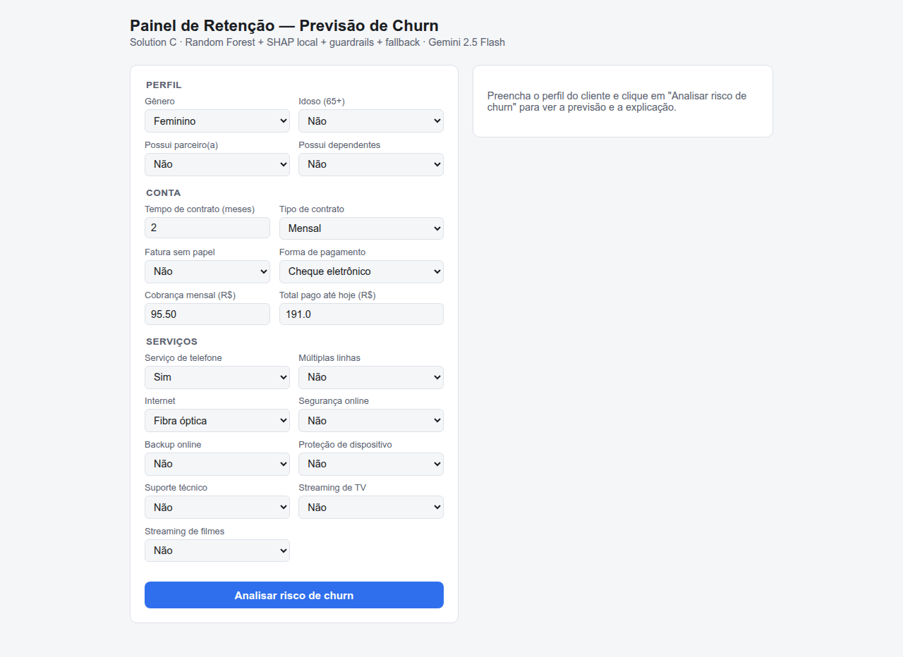
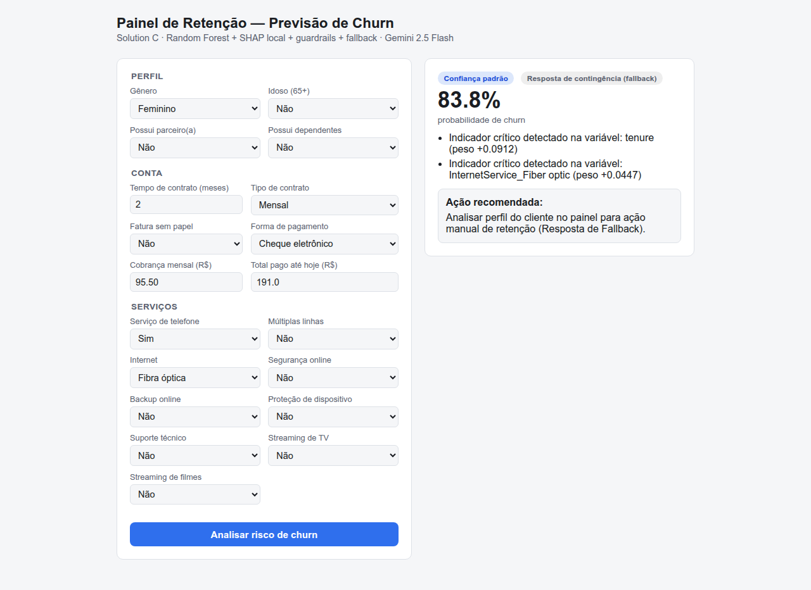

# Evidência — Etapa 10: Docker e painel web (09/07/2026)

> Solution C empacotada em Docker (sobe com um único comando via `docker compose`) e
> integrada a um painel web simples para a equipe de Customer Success. Validado com
> `docker compose` de verdade (não apenas lido/inspecionado), incluindo o cenário sem
> chave de API para confirmar que o fallback também funciona dentro do container.

## 1. Painel web

Novo: `solutions/solution-c/static/index.html` — formulário com os 19 campos do cliente
(perfil, conta, serviços), servido pelo próprio FastAPI via `StaticFiles` montado em `/`
(`solutions/solution-c/src/app.py`). Zero dependências novas — decisão confirmada com o
usuário antes de implementar (a stack fixada em `project-context.md` não define frontend).

Testado com Playwright (headless Chromium) contra o servidor local:

- **Carregamento inicial** — formulário completo renderizado, 19 campos.

  

- **Submissão do formulário** — `fetch()` para `POST /api/v1/predict`, resultado
  renderizado (probabilidade, badges de zona de confiança e de execução do LLM, fatores de
  risco, ação recomendada). Sem erros de console além de um 404 de favicon (corrigido com
  `<link rel="icon" href="data:,">` depois deste teste).

  

## 2. Docker

`docker/Dockerfile`: imagem `python:3.12-slim` (alinhada com a versão real usada em
desenvolvimento — `shap==0.52.0` exige 3.12+), copia o dataset e o código da Solution C
espelhando a estrutura relativa de pastas do repositório, treina o modelo **durante o
build** (gera `src/model.joblib` dentro da imagem, sem depender de volume montado nem
redistribuir o CSV bruto do dataset — ver `data/DATA_CARD.md` sobre a restrição de
licença). `.dockerignore` na raiz evita subir `.venv/`, `.git/`, caches e arquivos `.env`
para o contexto de build.

`docker-compose.yml`: um serviço, porta 8000, `GEMINI_API_KEY` passada via variável de
ambiente do host (nunca embutida na imagem).

### Build

```
$ docker compose build
...
#12 [churn-api 8/8] RUN python src/train.py
Iniciando treino do modelo Random Forest (Solution C)...
Treino concluído. Acurácia no teste: 0.7477 | ROC-AUC: 0.8388
...
Modelo salvo em src/model.joblib
#13 DONE 2.4s
```

Métricas idênticas às obtidas localmente (`docs/evidence/04-solution-c-validacao.md`) —
confirma que o ambiente containerizado reproduz o treino sem diferenças.

### Subida com chave real (comando único, documentado no README.md)

```bash
$ GEMINI_API_KEY=sua_chave docker compose up --build
```

```json
{
  "churn_probability": 0.85,
  "risk_factors": [
    "Baixa permanência do cliente (apenas 2 meses).",
    "Utilização do serviço de internet Fibra Óptica.",
    "Ausência de um contrato de fidelidade (contrato mensal)."
  ],
  "recommended_action": "Entrar em contato imediatamente para oferecer incentivos para a migração para um contrato de longo prazo (por exemplo, 1 ou 2 anos), além de verificar a satisfação com o serviço de Fibra Óptica e reforçar o valor dos benefícios do plano atual.",
  "system_status": { "llm_executed": true, "confidence_zone": "standard" }
}
```

`llm_executed: true` — chamada real ao Gemini 2.5 Flash de dentro do container, via rede
Docker até a internet.

### Subida sem chave — fallback dentro do container

```bash
$ docker compose up   # sem GEMINI_API_KEY definida
```

```
churn-api-1  | GEMINI_API_KEY não encontrada.
churn-api-1  | INFO:     172.18.0.1:36490 - "POST /api/v1/predict HTTP/1.1" 200 OK
```

```json
{
  "churn_probability": 0.85,
  "risk_factors": [
    "Indicador crítico detectado na variável: tenure (peso +0.0872)",
    "Indicador crítico detectado na variável: InternetService_Fiber optic (peso +0.0446)"
  ],
  "recommended_action": "Analisar perfil do cliente no painel para ação manual de retenção (Resposta de Fallback).",
  "system_status": { "llm_executed": false, "confidence_zone": "standard" }
}
```

Confirma que a degradação graciosa (agent.md §7) funciona de ponta a ponta no ambiente
containerizado, não só localmente — HTTP 200, nenhum crash, nenhuma exceção vazada.

### Comando único de verdade

`docker compose up --build` (build + treino + subida da API + painel) foi executado do
zero (sem cache de camadas na primeira vez) e depois novamente com cache — ambos os casos
resultaram no painel respondendo em `http://localhost:8000/` com `HTTP 200`.

## 3. Conclusão

O critério "Deployable" da régua do curso (`project-context.md` §3) está atendido: sobe
com um comando, alguém de fora consegue usar sem explicação (README.md na raiz cobre o
passo a passo), e é reproduzível a partir de um clone limpo — desde que o dataset seja
baixado antes, exatamente como já era exigido antes deste Docker existir (`DATA_CARD.md`).
